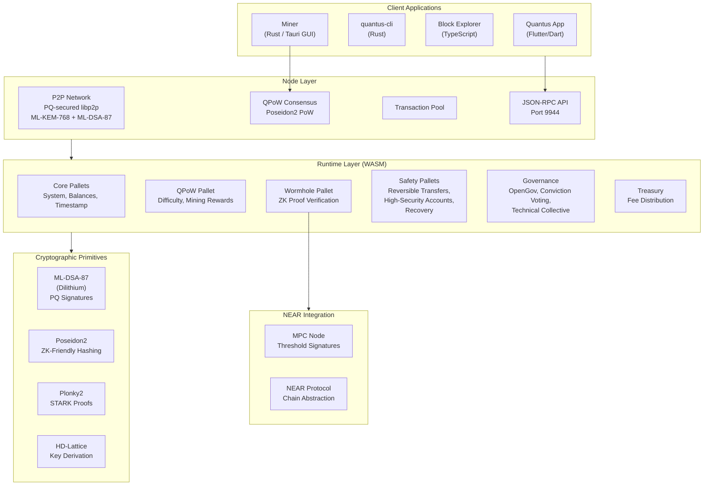
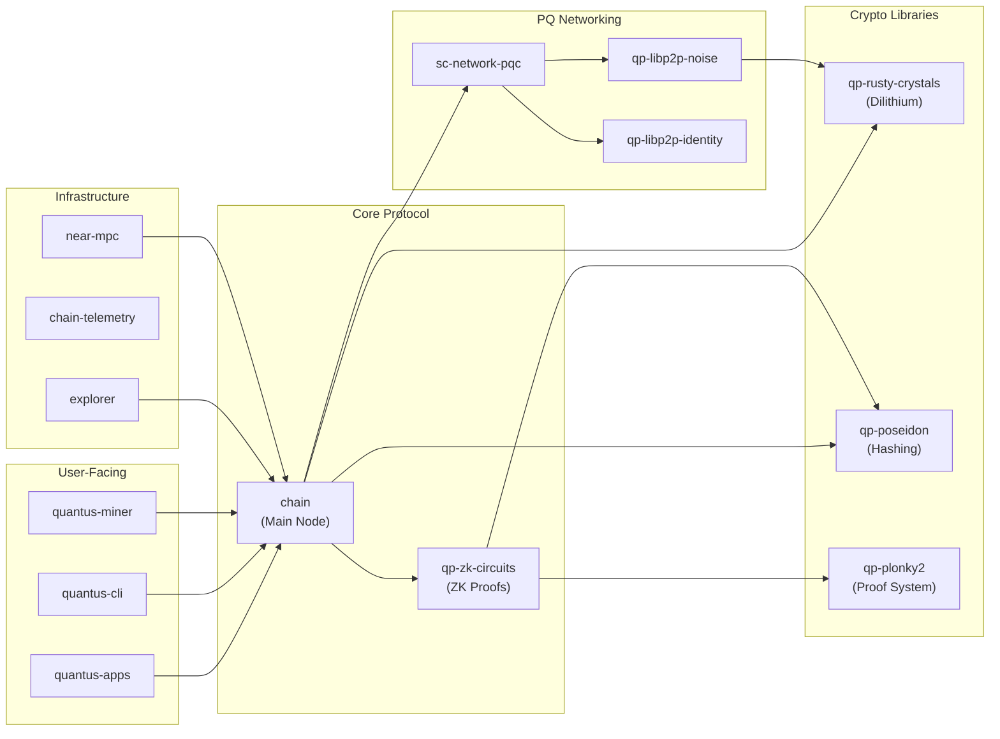

# Architecture Overview

Quantus is built on the [Substrate](https://substrate.io/) framework (Polkadot SDK), which provides a modular blockchain architecture with forkless upgrades via onchain WASM runtime swaps. The system consists of three layers: the node layer (networking, consensus, storage), the runtime layer (state transition logic, pallets), and cryptographic primitives that underpin both.

## System Architecture

## The Three Layers

### Node Layer

The client-side implementation handles networking, consensus participation, and storage. Key components:

| Component | Description | Source |
|-----------|-------------|--------|
| **P2P Networking** | Post-quantum secured via forked libp2p with ML-KEM-768 encryption and ML-DSA-87 peer identity | [qp-libp2p-noise](https://github.com/Quantus-Network/qp-libp2p-noise), [sc-network-pqc](https://github.com/Quantus-Network/sc-network-pqc) |
| **QPoW Consensus** | Custom proof-of-work engine using double Poseidon2 hashing | [chain/client/consensus/qpow](https://github.com/Quantus-Network/chain/tree/main/client/consensus/qpow) |
| **Transaction Pool** | Standard Substrate transaction pool with Dilithium signature validation | [chain/node](https://github.com/Quantus-Network/chain/tree/main/node) |
| **Storage** | RocksDB backend with Poseidon-hashed state trie (ZK-compatible) | [zk-trie](https://github.com/Quantus-Network/zk-trie) |

### Runtime Layer

The WASM-compiled state transition function, built using FRAME pallets. This is where all business logic lives, and it can be upgraded without hard forks via onchain governance.

**Core pallets:**
- **System / Balances / Timestamp:** Standard Substrate infrastructure
- **QPoW:** Mining difficulty adjustment, nonce verification, total work tracking
- **Mining Rewards:** Emission schedule (smooth exponential decay of 21M fixed supply)
- **Wormhole:** ZK proof verification for privacy-preserving transfers
- **Reversible Transfers:** Optional cancellation windows and high-security account protection
- **Multisig:** Multi-signature accounts with guardian oversight
- **Recovery:** Onchain survivorship (social recovery / "crypto will")
- **Governance:** Polkadot OpenGov with conviction voting and technical collective
- **Treasury:** Fee collection and distribution

### Cryptographic Primitives

Every cryptographic algorithm was chosen for a specific reason:

| Primitive | Algorithm | Why This Choice |
|-----------|-----------|-----------------|
| **Signatures** | ML-DSA-87 (Dilithium) | NIST Level 5 post-quantum standard. Lattice-based, no known quantum attacks. |
| **Block/Storage Hashing** | Poseidon2 | ~100x more efficient than SHA-256 inside ZK circuits. Enables ZK proofs over blockchain state. |
| **PoW Hashing** | Double Poseidon2 | ZK-friendly mining means proofs of mining work are cheap to verify in circuits. |
| **ZK Proofs** | Plonky2 (STARKs) | No trusted setup required. Recursive proof composition enables aggregation. |
| **P2P Encryption** | ML-KEM-768 (Kyber) | NIST post-quantum key encapsulation. Secures node-to-node communication. |
| **Key Derivation** | HD-Lattice (BIP-44 adapted) | Hierarchical deterministic wallets adapted for lattice-based cryptography. Path: `m/44'/189189'/index'/0'/0'` |

## The Signature Size Problem

Traditional PQC adoption faces a fundamental scaling crisis:

- Bitcoin ECDSA signature: **~65 bytes**
- ML-DSA-87 (Dilithium) signature: **~4,627 bytes** (70x larger)

If Bitcoin simply swapped to PQC signatures, throughput would drop from ~7 TPS to a fraction of that. Every block would be consumed by signature data.

## Quantus's Solution: Wormhole Addresses

Quantus solves the signature bloat problem with aggregated ZK proofs:

1. User burns coins to an unspendable **wormhole address** derived from `H(H(salt|secret))`
2. User generates a ZK proof (using Plonky2) that they know the preimage
3. Thousands of these proofs are **aggregated** into a single ~100KB proof
4. The aggregated proof is posted onchain, verifying all transactions at once

**Result:** Raw PQC throughput of ~685 TPS is amplified to **~153,000 TPS** (223x improvement).

The privacy benefit is a side effect: the link between the original sender and the exit address is broken onchain (similar to Tornado Cash's mechanism). Amounts and exit addresses are visible; the sender-receiver link is not.

## How Components Connect

## Key Design Decisions

**Why Substrate?** Forkless upgrades are critical for a chain that may need to swap cryptographic primitives as PQC standards evolve. NIST could deprecate an algorithm; Quantus can upgrade its runtime without coordinating a hard fork.

**Why PoW instead of PoS?** Quantus is a store of value, not a smart contract platform. PoW provides censorship resistance and fair distribution without the plutocratic dynamics of proof-of-stake. The Poseidon2-based PoW also creates synergy with the ZK proof system.

**Why no smart contracts?** Quantus is money, not a general-purpose compute platform. Limiting scope reduces attack surface and allows optimization for the specific use case of quantum-secure value transfer.

**Why fixed 21M supply?** Bitcoin's monetary model works. Quantus uses smooth exponential decay emission (`Reward = (MaxSupply - CurrentSupply) / K`) instead of Bitcoin's abrupt halvings, avoiding the mining incentive cliffs that halvings create.

## Next Steps

- **[Post-Quantum Cryptography](./deep-dives/pqc):** How Dilithium, Kyber, and HD-Lattice wallets work
- **[QPoW Consensus & Mining](./deep-dives/qpow):** The mining algorithm and difficulty adjustment
- **[Wormhole & ZK Scaling](./deep-dives/wormhole):** How ZK proofs solve the signature bloat problem
- **[User Safety Features](./deep-dives/safety):** Reversible transfers, guardians, and recovery
