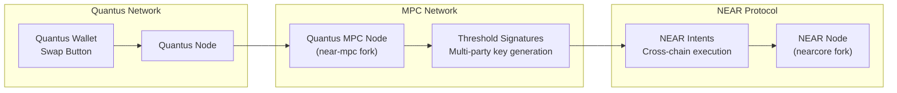

# NEAR Integration & Bridge

Quantus integrates with NEAR Protocol's chain abstraction infrastructure to enable cross-chain asset transfers. This is how users will bridge value in and out of Quantus without relying on centralized custodians.

## Why NEAR?

Quantus has a single native asset (QUAN) and no smart contracts. To interact with the broader crypto ecosystem (exchanges, DeFi, stablecoins), users need a bridge. NEAR's chain abstraction via **NEAR Intents** provides:

- **Decentralized signing** -- MPC threshold signatures instead of a trusted bridge operator
- **Cross-chain execution** -- Intent-based transactions that settle on both chains
- **Existing infrastructure** -- Battle-tested MPC network with active validators

## Architecture

## MPC Threshold Signatures

The bridge uses **secure multi-party computation (MPC)** where no single party holds the full signing key:

1. Multiple MPC nodes each hold a **key share**
2. A threshold number of nodes must cooperate to produce a valid signature
3. No single node can sign transactions alone
4. Even if some nodes are compromised, the key remains secure as long as the threshold isn't breached

This replaces the traditional "multisig bridge" model (where N-of-M known signers control a bridge wallet) with a cryptographic guarantee that the signing key is never reconstructed in any single location.

**Source:** [near-mpc](https://github.com/Quantus-Network/near-mpc) -- Fork of NEAR's MPC node implementation
**Audit:** Hashcloak threshold signature audit (in progress)

## Forked Dependencies

Quantus maintains forks of NEAR infrastructure adapted for post-quantum integration:

| Repository | Description |
|------------|-------------|
| [near-mpc](https://github.com/Quantus-Network/near-mpc) | MPC node for threshold signature generation |
| [nearcore](https://github.com/Quantus-Network/nearcore) | NEAR reference client fork |

## Current Status

| Component | Status |
|-----------|--------|
| MPC node implementation | In development |
| Threshold signature audit (Hashcloak) | In progress |
| NEAR Intents integration | In development |
| Testnet integration | Planned |
