# Post-Quantum Cryptography

Quantus replaces every quantum-vulnerable cryptographic primitive in the blockchain stack. This page covers the three PQC systems: transaction signatures, P2P encryption, and hierarchical deterministic wallet derivation.

## The Quantum Threat

Shor's algorithm, running on a sufficiently powerful quantum computer, can break:
- **ECDSA** (Bitcoin, Ethereum transaction signatures)
- **RSA** (legacy systems)
- **Diffie-Hellman** (key exchange)

Hash functions like SHA-256 are weakened by Grover's algorithm (security halved) but not broken. The practical timeline is debated, but NIST has already standardized post-quantum replacements -- the threat is real enough that the US government mandated migration by 2035.

## ML-DSA-87 (Dilithium) -- Transaction Signatures

Every Quantus transaction is signed with [ML-DSA-87](https://csrc.nist.gov/pubs/fips/204/final) (formerly CRYSTALS-Dilithium), the NIST post-quantum digital signature standard.

### How It Works

Dilithium is a lattice-based signature scheme. Its security relies on the hardness of the Module Learning With Errors (MLWE) problem, which has no known efficient quantum algorithm.

| Property | Value |
|----------|-------|
| Security Level | NIST Level 5 (equivalent to AES-256) |
| Public Key Size | ~2,592 bytes |
| Signature Size | ~4,627 bytes |
| Verification Time | ~2-3ms (vs ~0.5ms for ECDSA) |
| Quantum Resistant | Yes -- based on lattice problems |

### Integration in Quantus

```rust
// Runtime type definitions
pub type Signature = DilithiumSignatureScheme;
pub type AccountId = <<Signature as Verify>::Signer as IdentifyAccount>::AccountId;
```

Dilithium is the **only** signature scheme in the runtime. There is no fallback to ECDSA. Addresses use SS58 format with prefix 189 (addresses start with `qz...`).

**Source:** [qp-rusty-crystals](https://github.com/Quantus-Network/qp-rusty-crystals) -- Pure-Rust, no-std, constant-time implementation. Audited by Neodyme.

### The Signature Size Problem

The 70x size increase from ECDSA to Dilithium is the core challenge:

| Metric | ECDSA (Bitcoin) | ML-DSA-87 (Quantus) |
|--------|----------------|---------------------|
| Signature | ~65 bytes | ~4,627 bytes |
| Public Key | ~33 bytes | ~2,592 bytes |
| Per-transaction overhead | ~98 bytes | ~7,219 bytes |

This is why Quantus uses [Wormhole addresses with ZK proof aggregation](./wormhole) to compress thousands of transactions into a single proof.

## ML-KEM-768 (Kyber) -- P2P Encryption

Node-to-node communication is encrypted using [ML-KEM-768](https://csrc.nist.gov/pubs/fips/203/final) (formerly CRYSTALS-Kyber), the NIST post-quantum key encapsulation mechanism.

| Property | Value |
|----------|-------|
| Security Level | NIST Level 3 |
| Ciphertext Size | 1,088 bytes |
| Shared Secret Size | 32 bytes |
| Purpose | Secure P2P channel establishment |

Quantus forked the Rust libp2p networking stack to replace classical key exchange with ML-KEM-768 and peer identity authentication with ML-DSA-87:

- [qp-libp2p-noise](https://github.com/Quantus-Network/qp-libp2p-noise) -- PQ Noise protocol implementation
- [qp-libp2p-identity](https://github.com/Quantus-Network/qp-libp2p-identity) -- PQ peer identity
- [sc-network-pqc](https://github.com/Quantus-Network/sc-network-pqc) -- PQ fork of Substrate networking

This means the entire communication layer is quantum-secure, not just the transactions.

## HD-Lattice Wallets -- Key Derivation

Standard BIP-32 hierarchical deterministic (HD) wallets rely on elliptic curve algebra that doesn't exist in lattice cryptography. Quantus implements a custom HD derivation scheme adapted for lattice-based keys.

### Derivation Path

Following BIP-44 structure:

```
m / 44' / 189189' / account' / 0' / 0'
```

| Component | Value | Meaning |
|-----------|-------|---------|
| Purpose | 44' | BIP-44 standard |
| Coin Type | 189189' | Quantus Network identifier |
| Account | index' | Account index (configurable) |
| Change | 0' | External chain |
| Address | 0' | First address |

All components are hardened (indicated by `'`) because lattice-based key derivation requires it -- unhardened derivation would leak information about the parent key.

### How It Works

1. Generate or restore a 24-word BIP-39 mnemonic
2. Derive a 64-byte seed using standard BIP-39 `mnemonic_to_seed()`
3. Apply HMAC-based derivation along the path, using each step's output as entropy for lattice key generation
4. Generate a Dilithium keypair from the final derived seed

```bash
# Generate a new key
./quantus-node key quantus

# Restore from mnemonic
./quantus-node key quantus --words "autumn bear..."

# Restore from seed
./quantus-node key quantus --seed "<64-HEX-STRING>"
```

**Source:** [qp-rusty-crystals](https://github.com/Quantus-Network/qp-rusty-crystals) (hdwallet module)

## Poseidon2 -- ZK-Friendly Hashing

While not a PQC algorithm per se (hash functions are already quantum-resistant), Poseidon2 was chosen specifically for zero-knowledge proof efficiency:

| Property | Poseidon2 | SHA-256 | Blake2 |
|----------|-----------|---------|--------|
| ZK circuit constraints | ~300 | ~25,000 | ~10,000 |
| Native speed | Slower | Fast | Fastest |
| ZK-circuit speed | Fastest | Slowest | Slow |

Poseidon2 uses arithmetic operations over prime fields, which map directly to ZK circuit operations. This makes it ~100x more efficient than SHA-256 inside a ZK proof.

### Where Poseidon2 is Used

- **Block headers** -- All block hashes use `PoseidonHasher`
- **Storage trie** -- State trie uses Poseidon for ZK-compatible storage proofs
- **QPoW mining** -- Double Poseidon2 hashing for proof-of-work
- **Wormhole circuits** -- Merkle proof verification inside ZK proofs

**Sources:** [qp-poseidon](https://github.com/Quantus-Network/qp-poseidon), [qp-poseidon-constants](https://github.com/Quantus-Network/qp-poseidon-constants)

## Cryptographic Dependency Map

```mermaid
graph TB
    subgraph Signatures["Post-Quantum Signatures"]
        DilithiumCrypto["qp-dilithium-crypto<br/>Runtime signature type"]
        RustyCrystals["qp-rusty-crystals<br/>Core Dilithium impl"]
        HDWallet["HD-Lattice Wallet<br/>BIP-44 derivation"]
        DilithiumCrypto --> RustyCrystals
        DilithiumCrypto --> HDWallet
    end

    subgraph Hashing["ZK-Friendly Hashing"]
        PoseidonLib["qp-poseidon<br/>PoseidonHasher"]
        PoseidonCore["qp-poseidon-core<br/>Poseidon2Core"]
        PoseidonConsts["qp-poseidon-constants<br/>Goldilocks field"]
        PoseidonLib --> PoseidonCore
        PoseidonCore --> PoseidonConsts
    end

    subgraph ZK["Zero-Knowledge Proofs"]
        Circuit["qp-wormhole-circuit"]
        Verifier["qp-wormhole-verifier"]
        Plonky2["qp-plonky2<br/>STARK backend"]
        Common["qp-zk-circuits-common"]
        Circuit --> Plonky2
        Circuit --> Common
        Verifier --> Common
    end

    subgraph Network["PQ Networking"]
        Noise["qp-libp2p-noise"]
        Identity["qp-libp2p-identity"]
        SCNet["sc-network-pqc"]
        SCNet --> Noise
        SCNet --> Identity
    end
```



## External Audits

| Auditor | Scope | Status |
|---------|-------|--------|
| **Neodyme** | ML-DSA-87 implementation (qp-rusty-crystals) | Completed |
| **Eiger** | Hash algorithm and consensus | Completed |
| **Eiger** | ZK circuits (qp-zk-circuits) | In progress |
| **Hashcloak** | Threshold signatures (near-mpc) | In progress |
