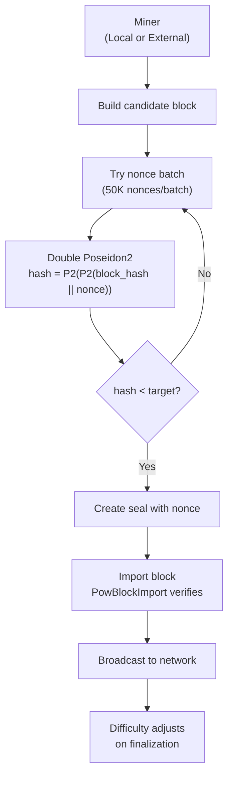

# QPoW Consensus & Mining

Quantus uses a custom Proof-of-Work consensus mechanism called **QPoW (Quantum Proof-of-Work)**. It replaces SHA-256 with Poseidon2 hashing, so the mining algorithm and ZK proof system share the same hash function.

## Why Proof of Work?

Quantus is a store of value, not a smart contract platform. PoW provides:

- **Fair distribution:** Anyone can mine, no minimum stake required
- **Censorship resistance:** No validator set that can be coerced
- **No plutocracy:** Wealth doesn't compound into more consensus power
- **Proven security model:** 15+ years of battle-tested economics from Bitcoin

## How QPoW Works

The mining algorithm uses **double Poseidon2 hashing** instead of SHA-256:

```
nonce_hash = Poseidon2(Poseidon2(block_hash || nonce))
valid = nonce_hash < (U512::MAX / difficulty)
```

A miner finds a valid block by searching for a nonce where the double Poseidon2 hash is below the difficulty target.

### Why Poseidon2?

Poseidon2 was chosen for ZK circuit efficiency, **not** for quantum resistance (SHA-256 is already quantum-resistant enough). The benefit is that mining work can be efficiently verified inside ZK proofs, which enables future features like provable mining statistics and ZK-verified mining pools.

### Mining Flow



## Chain Parameters

| Parameter | Value | Description |
|-----------|-------|-------------|
| Block Time | 12 seconds target | `TARGET_BLOCK_TIME_MS` |
| Max Reorg Depth | 180 blocks | `MaxReorgDepth` |
| Difficulty Adjustment | +/-10% per block | `DifficultyAdjustPercentClamp` |
| EMA Smoothing | alpha = 0.1 | `EmaAlpha = 100/1000` |
| Finalization | 179 blocks behind best | `MaxReorgDepth - 1` |
| Native Token | QU (12 decimals) | Max supply 21,000,000 |
| SS58 Prefix | 189 | Addresses start with `qz...` |

## Difficulty Adjustment

Difficulty adjusts on every finalized block using an exponential moving average (EMA):

1. Compute actual block time for the finalized block
2. Apply EMA smoothing: `ema = actual_time * alpha + prev_ema * (1 - alpha)`
3. Compare EMA to target block time
4. Adjust difficulty up or down, clamped to +/-10% per adjustment

This produces smoother difficulty curves than Bitcoin's 2016-block epoch adjustments, responding faster to hashrate changes while avoiding oscillation.

## Chain Selection: Heaviest Chain

Instead of "longest chain" (most blocks), Quantus uses **heaviest chain** (most cumulative work):

- Each block adds its difficulty to the chain's `TotalWork`
- Fork choice selects the chain with highest `TotalWork`
- This correctly weights high-difficulty blocks over many easy blocks

Finalization occurs automatically at `MaxReorgDepth - 1` blocks behind the best block (179 blocks), meaning blocks older than ~36 minutes are considered final.

## Mining Modes

### Local Mining (Built-in)

The node binary includes a built-in miner for testing and small-scale mining:

```bash
./quantus-node \
    --validator \
    --chain dirac \
    --rewards-preimage <YOUR_PREIMAGE>
```

Processes 50,000 nonces per batch.

### External Mining

For higher performance, a separate miner process offloads the PoW computation:

```bash
# Start the external miner
./quantus-miner

# Start the node pointing to the external miner
./quantus-node \
    --validator \
    --chain dirac \
    --external-miner-url http://127.0.0.1:9833 \
    --rewards-preimage <YOUR_PREIMAGE>
```

The external miner communicates via HTTP API on port 9833, receiving mining jobs and submitting solutions.

**Source:** [quantus-miner](https://github.com/Quantus-Network/quantus-miner)

### GUI Miner

A desktop application built with Tauri wraps the miner CLI for non-technical users.

**Source:** [miner-tauri-gui](https://github.com/Quantus-Network/miner-tauri-gui)

## Mining Rewards

All mining rewards are sent to **wormhole addresses** derived from the miner's preimage. This is **not** optional. It is built into the protocol.

### Wormhole Address Derivation for Miners

1. Generate a wormhole key pair: `./quantus-node key quantus --scheme wormhole`
2. The `inner_hash` (preimage) is used as the `--rewards-preimage` parameter
3. The node derives the wormhole address on startup
4. All block rewards and transaction fees are sent to this address

This means mining rewards are automatically privacy-preserving. The miner's identity is not linked to their reward address onchain.

### Emission Schedule

Quantus uses smooth exponential decay instead of Bitcoin's abrupt halvings:

```
Block Reward = (MaxSupply - CurrentSupply) / EmissionDivisor
```

- No halving cliffs that disrupt mining economics
- ~99% of supply emitted within ~40 years
- Miners receive 50% of total supply over time
- Company receives 15% via dev tax on block rewards (~5 years to fully vest)

### Fee Structure

| Transaction Type | Fee Model |
|-----------------|-----------|
| Standard transfer | Miner tip (priority fee) |
| Wormhole / High-Security | Volume fee split between miner and **burn** |

## Key Source Code

| Component | Repository | Path |
|-----------|-----------|------|
| QPoW math (nonce hash, validation) | [chain](https://github.com/Quantus-Network/chain) | `qpow-math/src/lib.rs` |
| Consensus engine | [chain](https://github.com/Quantus-Network/chain) | `client/consensus/qpow/` |
| QPoW pallet (difficulty, rewards) | [chain](https://github.com/Quantus-Network/chain) | `pallets/qpow/` |
| Mining rewards pallet | [chain](https://github.com/Quantus-Network/chain) | `pallets/mining-rewards/` |
| External miner | [quantus-miner](https://github.com/Quantus-Network/quantus-miner) | Root |
| Miner GUI | [miner-tauri-gui](https://github.com/Quantus-Network/miner-tauri-gui) | Root |
| Poseidon2 hash function | [qp-poseidon](https://github.com/Quantus-Network/qp-poseidon) | Root |
