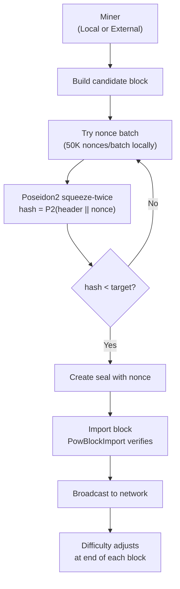

# QPoW Consensus & Mining

Quantus uses a custom Proof-of-Work engine called **QPoW**. The name is branding — the work function is Poseidon2 hash grinding, not a lattice problem. Signatures are the lattice part (ML-DSA-87). Poseidon2 is shared with the ZK stack so mining work can be checked cheaply inside circuits.

## Why Proof of Work?

Quantus is a store of value, not a smart contract platform. PoW provides:

- **Fair distribution:** Anyone can mine, no minimum stake required
- **Censorship resistance:** No validator set that can be coerced
- **No plutocracy:** Wealth doesn't compound into more consensus power
- **Proven security model:** 15+ years of battle-tested economics from Bitcoin

## How QPoW Works

A miner searches for a 512-bit nonce such that a single Poseidon2 permutation of the pre-seal header hash and nonce, squeezed twice to 512 bits, is below the difficulty target:

```
input      = pre_seal_header_hash || nonce    # 32 + 64 = 96 bytes
nonce_hash = Poseidon2_squeeze_twice(input)    # 512-bit digest
valid      = nonce_hash < (U512::MAX / difficulty)
```

This is **not** `Poseidon2(Poseidon2(...))`. `hash_squeeze_twice` is one permutation with two squeezes (`qpow-math`).

Poseidon2 was chosen for ZK circuit efficiency, **not** for quantum resistance (SHA-256 is already quantum-resistant enough). That enables future features like provable mining statistics and ZK-verified pools.

### Mining Flow


```mermaid
flowchart TD
    Miner["Miner<br/>(Local or External)"] --> BuildBlock["Build candidate block"]
    BuildBlock --> TryNonce["Try nonce batch<br/>(50K nonces/batch locally)"]
    TryNonce --> Hash["Poseidon2 squeeze-twice<br/>hash = P2(header || nonce)"]
    Hash --> Check{"hash < target?"}
    Check -->|No| TryNonce
    Check -->|Yes| Seal["Create seal with nonce"]
    Seal --> Import["Import block<br/>PowBlockImport verifies"]
    Import --> Broadcast["Broadcast to network"]
    Broadcast --> Difficulty["Difficulty adjusts<br/>at end of each block"]
```

## Chain Parameters

| Parameter | Value | Notes |
|-----------|-------|-------|
| Block time | 12s target | `TARGET_BLOCK_TIME_MS = 12_000` |
| Max reorg depth | 100 blocks | `MaxReorgDepth`; ~20 minutes at target |
| Difficulty retarget | Every block | Ethereum Homestead-style, not EMA |
| Max difficulty increase | +1/2048 (~0.05%) | Observed time &lt; 10s (`adjustment = 1`) |
| Max difficulty decrease | −99/2048 (~4.8%) | −1/2048 per extra 10s after 20s, floored at −99 |
| Native token | QTC, 12 decimals | Max supply 21,000,000 |
| SS58 prefix | 189 | Addresses start with `qz...` |

## Difficulty Adjustment

`pallet_qpow` retargets at the end of **every executed block** (`on_finalize`). Client finalization (`MaxReorgDepth`) is a separate fork-pruning rule and does not trigger the retarget.

The formula matches Ethereum Homestead PoW, scaled to a 12s target (10s buckets):

```
divisor    = target_ms * 10 / 12          # 10,000 ms at 12s
adjustment = max(1 - floor(block_time / divisor), -99)
difficulty = parent + (parent / 2048) * adjustment
```

| Observed block time | Adjustment |
|---------------------|------------|
| &lt; 10s | +1/2048 (~0.05%) |
| 10s–20s | none |
| 20s–30s | −1/2048 |
| … | −1/2048 per extra 10s, down to −99/2048 (~4.8%) |

Observed time is floored at 500ms so a tiny timestamp delta cannot pump difficulty. Results are also clamped to a minimum difficulty of 131,072 and a maximum of `U512::MAX`.

## Chain Selection: Heaviest Chain

Fork choice is **heaviest chain** (most cumulative work), not longest chain:

- Each valid block adds the **target difficulty at that height** (the difficulty the seal had to beat), not `U512::MAX / nonce_hash`
- Work is stored in the client aux DB, not as an on-chain `TotalWork` item
- Equal work ties break toward the higher block number

Finalization is automatic: after each import the client finalizes the block `MaxReorgDepth` (100) behind the best tip, so blocks older than ~20 minutes at target time are treated as final.

## Mining Modes

A validator will not mine while it is still catching up: the tip must look fresh (`--max-tip-age`, default 24 hours) and the node must have peers (30s grace, then pause). `--force-authoring` bypasses those gates and is only for bootstrapping a new network — do not use it to join mainnet.

### Built-in Mining (CPU Only)

Without `--miner-listen-port`, the node mines locally. The loop tries 50,000 nonces from a random start, then yields (~50–100ms) so the node stays responsive.

```bash
./quantus-node \
    --validator \
    --chain mainnet \
    --node-key-file ~/.quantus/node_key.p2p \
    --rewards-inner-hash <YOUR_INNER_HASH>
```

This is fine for testing. Production mining should use the external miner.

### External Mining (GPU Recommended)

`--miner-listen-port` turns the node into a QUIC job server and **disables** local mining. If the miner server fails to start, the node exits — it does not fall back to CPU mining.

```bash
RUST_LOG=info ./quantus-node \
    --validator \
    --chain mainnet \
    --node-key-file ~/.quantus/node_key.p2p \
    --rewards-inner-hash <YOUR_INNER_HASH> \
    --miner-listen-port 9833

CHAIN_DIR="$HOME/.local/share/quantus-node/chains/mainnet"
# macOS: CHAIN_DIR="$HOME/Library/Application Support/quantus-node/chains/mainnet"
RUST_LOG=info ./quantus-miner serve \
    --node-addr 127.0.0.1:9833 \
    --auth-token-file "$CHAIN_DIR/miner-auth-token" \
    --tls-cert-sha256-file "$CHAIN_DIR/miner-tls-cert-sha256" \
    --gpu-devices 1 \
    --cpu-workers 0
```

Quote `CHAIN_DIR` on macOS — `Application Support` contains a space. The token is not logged -- read `miner-auth-token`. Miners must pin `miner-tls-cert-sha256`. Do not expose port 9833/UDP publicly.

GPU mining is much faster than the built-in CPU loop. Multiple miners can connect to the same node; the node broadcasts the same job and the first valid result wins.

For the QUIC protocol, see [External Miner Protocol](./miner-protocol.md). Operator setup: [Mining Guide](../guides/mining.md).

**Source:** [quantus-miner](https://github.com/Quantus-Network/quantus-miner)

## Mining Rewards

All mining rewards are paid to a **wormhole address** derived from the miner's `--rewards-inner-hash`. This is required by the protocol.

### Wormhole Address Derivation for Miners

1. Generate a wormhole key pair: `./quantus-node key quantus --scheme wormhole`
2. Save **Address** (where rewards go), **Inner Hash** (pass to the node), and — for a fresh key — the **Secret phrase** (offline backup; only printed when newly generated)
3. Pass the inner hash as `--rewards-inner-hash`
4. The node derives the wormhole address on startup and logs it

Existing wallet holders can derive the same keypair with `--words` or `--seed` (no argument: secret is read from stdin, never from argv). That path prints only Address and Inner Hash.

### Emission Schedule

```
Block Reward = (MaxSupply - CurrentSupply) / EmissionDivisor
```

Mainnet `EmissionDivisor` is `50_000_000`. There is no halving. **100% of each block reward and 100% of standard transaction fees go to the miner** (quantized to the wormhole leaf quantum). There is no dev tax and no treasury cut of block rewards.

27% of `MAX_SUPPLY` is allocated at genesis via vesting. The remaining ~73% is emitted to miners over time.

### Fee Structure

| Transaction type | Fee model |
|------------------|-----------|
| Standard transfer | Weight + length fees, plus optional tip → miner |
| Wormhole exit | 4 bps volume fee: 50% burned, 50% miner |
| High-security / reversible | 1% volume fee, burned (no miner split; high-security senders cannot tip) |

## Key Source Code

| Component | Repository | Path |
|-----------|-----------|------|
| PoW math (nonce hash, validation) | [chain](https://github.com/Quantus-Network/chain) | `qpow-math/src/lib.rs` |
| Consensus engine / fork choice | [chain](https://github.com/Quantus-Network/chain) | `client/consensus/qpow/` |
| Difficulty retarget | [chain](https://github.com/Quantus-Network/chain) | `pallets/qpow/` |
| Block rewards and fee payout | [chain](https://github.com/Quantus-Network/chain) | `pallets/mining-rewards/` |
| External miner | [quantus-miner](https://github.com/Quantus-Network/quantus-miner) | Root |
| Poseidon2 hash function | [qp-poseidon](https://github.com/Quantus-Network/qp-poseidon) | Root |
