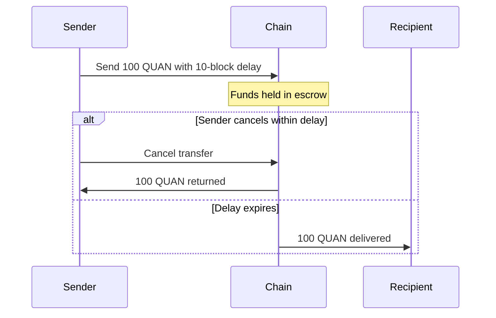
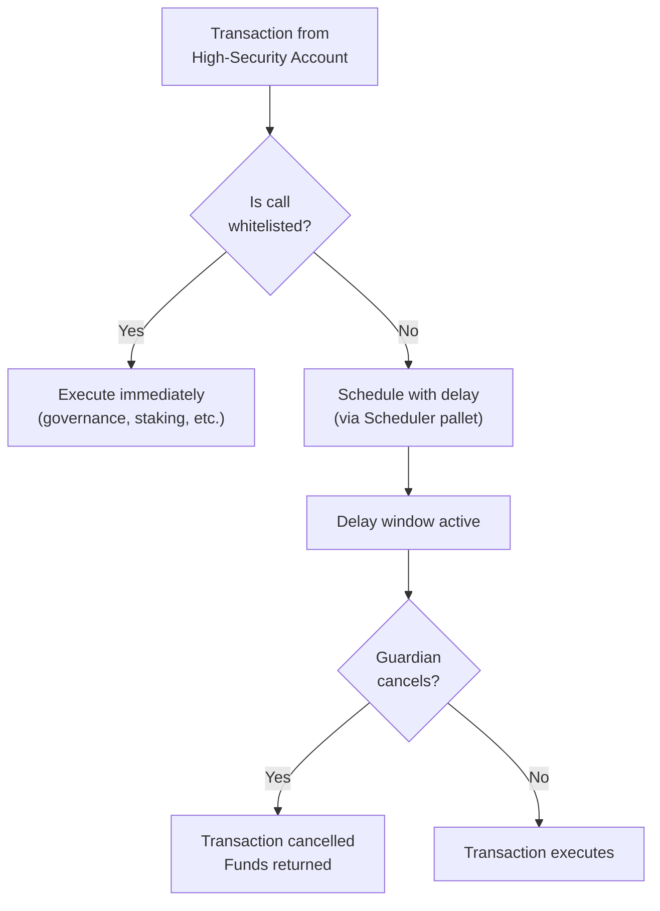

# User Safety Features

Quantus includes protocol-level safety features that don't exist on any other blockchain. These aren't smart contract add-ons -- they are built into the runtime's transaction processing pipeline.

## Overview

| Feature | What It Does | Bitcoin / Ethereum Equivalent |
|---------|-------------|------------------------------|
| **Check-Phrases** | Human-readable address verification | None |
| **Reversible Transfers** | Sender-defined cancellation windows | None (transactions are final) |
| **High-Security Accounts** | Mandatory delay + guardian oversight | None (multisig is opt-in, no delay) |
| **Survivorship** | On-chain "will" via social recovery | None (keys lost = funds lost) |

## Check-Phrases

Post-quantum addresses are long and error-prone. Check-phrases convert address checksums into human-readable BIP-39 word sequences, making it easy to verify you're sending to the right address.

Instead of comparing `qz4R7k2L...` character by character, you compare a short phrase like **"autumn river crystal"** -- the recipient can confirm this matches their address.

The checksum uses a 50,000-iteration key derivation function (KDF) to prevent brute-force generation of vanity check-phrases.

**Source:** [qp-human-checkphrase](https://github.com/Quantus-Network/qp-human-checkphrase)

## Reversible Transfers

Any sender can attach an optional **delay window** to a transfer. During this window, the sender can cancel the transaction and reclaim their funds.

### How It Works

1. Sender submits a transfer with a delay parameter (number of blocks)
2. Funds are held in a reversible-transfer escrow, not yet credited to the recipient
3. During the delay window, the sender can cancel
4. After the delay expires, the transfer executes automatically via the Scheduler pallet

This is enforced at the **transaction extension level** (Stage 10 of the 11-stage validation pipeline), meaning it applies transparently to any qualifying transaction.

### Use Cases

- **Fat-finger protection** -- Cancel a transfer you sent to the wrong address
- **Fraud mitigation** -- If your keys are compromised, you have a window to cancel outgoing transfers
- **Business workflows** -- Payment holds, approval windows, staged disbursements

## High-Security Accounts

High-security accounts take reversibility further by making delay windows **mandatory** and adding **guardian oversight**.

### Configuration

When an account opts into high-security mode:
- **All non-whitelisted transactions** are automatically delayed
- A designated **guardian** (another account, multisig, or hardware wallet) can cancel any pending transaction during the delay
- Certain operations (governance voting, account management) are whitelisted for immediate execution

### Guardian System

### Whitelisted Operations

The following calls execute immediately even from high-security accounts:
- System calls (`frame_system`)
- Governance operations (referenda, conviction voting)
- Account management (recovery, multisig setup)
- Treasury proposals

Everything else (transfers, staking, contract interactions) goes through the delay period.

## Survivorship / Recovery

Quantus implements on-chain social recovery, effectively creating a "crypto will":

- An account owner designates **recovery contacts** (trusted friends, family members, or institutions)
- If the owner loses access, recovery contacts can collectively initiate account recovery after a configurable delay
- The delay prevents abuse while giving the legitimate owner time to intervene

This uses Substrate's `pallet-recovery` with configurable parameters:
- **MaxFriends** -- Maximum number of recovery contacts
- **Delay period** -- Time between recovery initiation and execution
- **Threshold** -- Number of friends required to approve recovery

### Why This Matters

An estimated $250B-$500B in Bitcoin is permanently lost due to lost keys. Quantus's recovery mechanism ensures that value can be recovered by designated parties, without introducing custodial risk during normal operation.

## Multisig Accounts

Standard multi-signature support with Quantus-specific enhancements:

- Configurable signer threshold (M-of-N)
- Integration with high-security account features
- Guardian designation for multisig accounts
- Dissolution cleanup (prevents orphaned proposals from blocking account operations)

**Source:** [chain/pallets/multisig](https://github.com/Quantus-Network/chain/tree/main/pallets/multisig)

## Transaction Processing Pipeline

All safety features are enforced through the runtime's 11-stage transaction extension pipeline:

| Stage | Extension | Safety Role |
|-------|-----------|-------------|
| 1-7 | Standard FRAME checks | Replay protection, fee validation, weight checks |
| 8 | ChargeTransactionPayment | Fee reservation |
| 9 | CheckMetadataHash | Client compatibility |
| **10** | **ReversibleTransactionExtension** | **High-security account validation and delay routing** |
| **11** | **WormholeProofRecorderExtension** | **Cross-chain proof recording for mining rewards** |

Stages 10 and 11 are custom Quantus extensions that integrate safety and cross-chain features directly into the transaction processing path.

## Key Source Code

| Component | Repository | Path |
|-----------|-----------|------|
| Reversible transfers pallet | [chain](https://github.com/Quantus-Network/chain) | `pallets/reversible-transfers/` |
| Multisig pallet | [chain](https://github.com/Quantus-Network/chain) | `pallets/multisig/` |
| Transaction extensions | [chain](https://github.com/Quantus-Network/chain) | `runtime/src/transaction_extensions.rs` |
| Recovery pallet | [chain](https://github.com/Quantus-Network/chain) | Standard Substrate `pallet-recovery` |
| Scheduler pallet | [chain](https://github.com/Quantus-Network/chain) | `pallets/scheduler/` |
| Check-phrases | [qp-human-checkphrase](https://github.com/Quantus-Network/qp-human-checkphrase) | Root |
