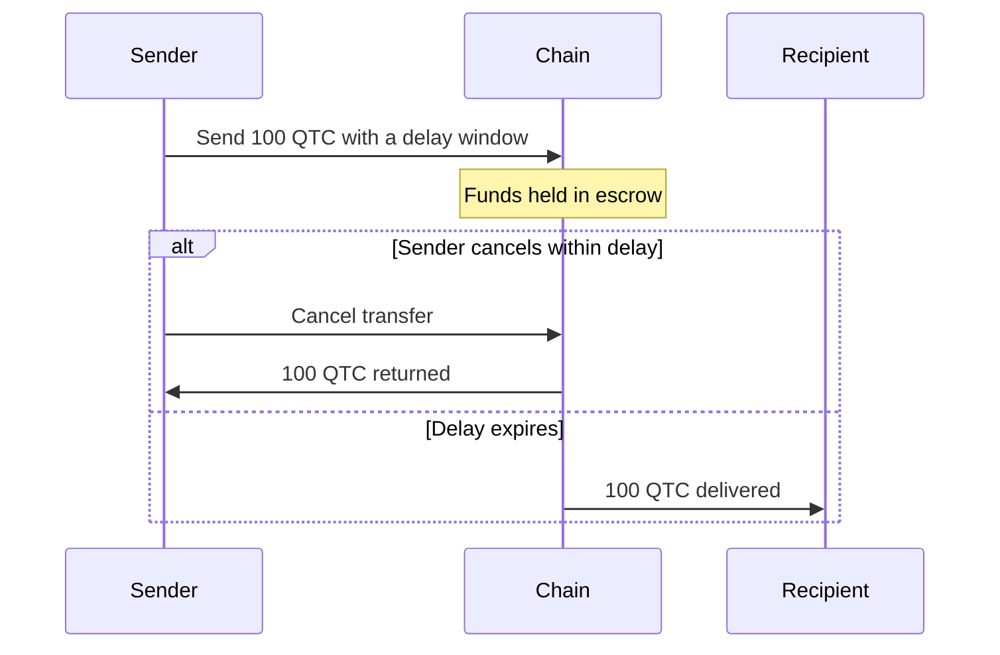
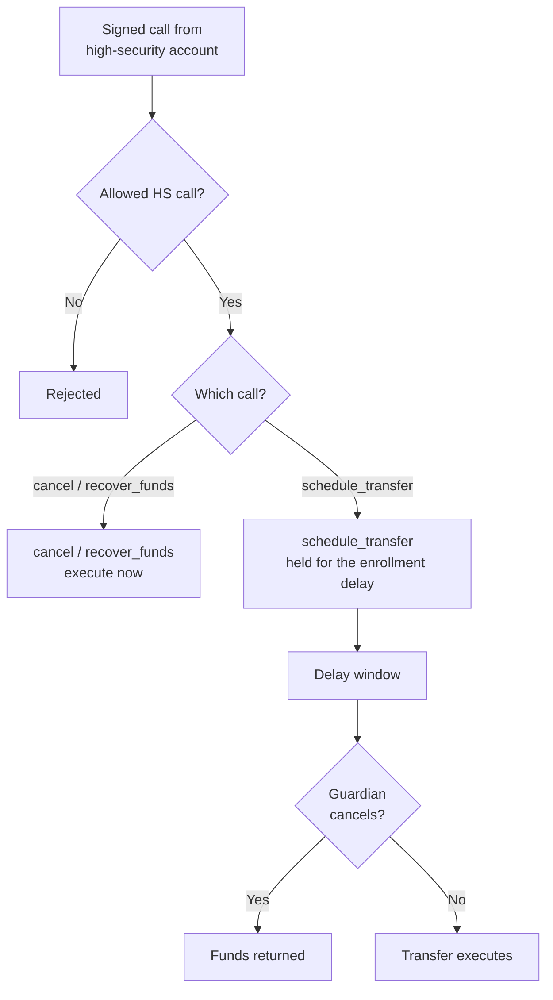

# User Safety Features

Quantus includes protocol-level safety features that don't exist on any other blockchain. These aren't smart contract add-ons -- they are built into the runtime's transaction processing pipeline.

## Overview

| Feature | What It Does | Bitcoin / Ethereum Equivalent |
|---------|-------------|------------------------------|
| **Check-Phrases** | Human-readable address verification | None |
| **Reversible Transfers** | Sender-defined cancellation windows | None (transactions are final) |
| **High-Security Accounts** | One-way lock: only reversible transfers, plus a guardian who can cancel or seize | None (multisig is opt-in, no delay) |
| **Guardian recovery** | Guardian can cancel pending transfers and `recover_funds` (sweep all holds + free balance) | None (keys lost = funds lost) |

## Check-Phrases

Post-quantum addresses are long and error-prone. Check-phrases convert address checksums into human-readable BIP-39 word sequences, making it easy to verify you're sending to the right address.

Instead of comparing `qz4R7k2L...` character by character, you compare a short phrase like **"autumn river crystal"** -- the recipient can confirm this matches their address.

The checksum uses a 50,000-iteration key derivation function (KDF) to prevent brute-force generation of vanity check-phrases.

**Source:** [qp-human-checkphrase](https://github.com/Quantus-Network/qp-human-checkphrase)

## Reversible Transfers

Any sender can attach an optional **delay window** to a transfer. During this window, the sender can cancel the transaction and reclaim their funds.

```mermaid
sequenceDiagram
    participant Sender
    participant Chain
    participant Recipient

    Sender->>Chain: Send 100 QTC with a delay window
    Note over Chain: Funds held in escrow

    alt Sender cancels within delay
        Sender->>Chain: Cancel transfer
        Chain->>Sender: 100 QTC returned
    else Delay expires
        Chain->>Recipient: 100 QTC delivered
    end
```

### How It Works

1. Sender dispatches `ReversibleTransfers::schedule_transfer_with_delay` with an explicit delay (number of blocks)
2. Funds are held in a reversible-transfer escrow, not yet credited to the recipient
3. During the delay window, the sender can cancel
4. After the delay expires, the transfer executes automatically via the Scheduler pallet

A normal `Balances` transfer is not intercepted. Delay is opt-in at the pallet. `ReversibleTransactionExtension` only classifies high-security signers and applies their whitelist, size/fee caps, and rolling quota.

### Use Cases

- **Fat-finger protection** -- Cancel a transfer you sent to the wrong address
- **Fraud mitigation** -- If your keys are compromised, you have a window to cancel outgoing transfers
- **Business workflows** -- Payment holds, approval windows, staged disbursements

## High-Security Accounts

High-security accounts take reversibility further by making delay windows **mandatory** and adding **guardian oversight**.

### Configuration

When an account opts into high-security mode it is a **one-way** change. The account can no longer send ordinary transfers.

Allowed calls (the runtime whitelist) are only:
- `ReversibleTransfers::schedule_transfer` (destination must be an account id)
- `ReversibleTransfers::cancel`
- `ReversibleTransfers::recover_funds`
- `Utility::batch_all` of those, max 16 leaves, no nesting

Everything else is **rejected**, not delayed. There is no immediate path for governance, treasury, staking, or contracts (Quantus has no contracts or staking).

Other HS constraints:
- Mandatory delay on every scheduled transfer (the delay chosen at enrollment)
- Guardian can cancel pending transfers during the window
- Guardian can call `recover_funds` to seize every pending hold plus the free balance
- High-security signers cannot tip
- High-security reversals pay a **1% volume fee, burned**
- At most 16 signed extrinsics per rolling day (`MaxHighSecurityTxsPerWindow`)

Quota keys on the outer signer and applies only to high-security accounts. A normal guardian has no cap. A **single-key guardian that is itself high-security** shares the 16-per-window quota with its own traffic and can be locked out of `cancel` / `recover_funds` for up to a day. A **multisig guardian** is recommended: the derived address never signs, so the quota never applies to it — even if the multisig is high-security.

### Guardian System

```mermaid
flowchart TD
    TX["Signed call from<br/>high-security account"]
    Check{"Allowed HS call?"}
    Reject["Rejected"]
    Kind{"Which call?"}
    Immediate["cancel / recover_funds<br/>execute now"]
    Delayed["schedule_transfer<br/>held for the enrollment delay"]
    Window["Delay window"]
    Guardian{"Guardian<br/>cancels?"}
    Cancel["Funds returned"]
    Execute["Transfer executes"]

    TX --> Check
    Check -->|No| Reject
    Check -->|Yes| Kind
    Kind -->|cancel / recover_funds| Immediate
    Kind -->|schedule_transfer| Delayed
    Delayed --> Window
    Window --> Guardian
    Guardian -->|Yes| Cancel
    Guardian -->|No| Execute
```

### Guardian recovery

`pallet-recovery` is **not** in the runtime. Recovery is the high-security guardian:

- `cancel` stops a pending delayed transfer
- `recover_funds` sweeps every pending hold and the remaining free balance to the guardian. It can be retried if the final sweep fails. The high-security status stays in place afterward.

The guardian has instant seizure power. Choose it as carefully as a recovery key — typically a multisig, not a single hot wallet.

## Multisig Accounts

Standard multi-signature support with Quantus-specific enhancements:

- Configurable signer threshold (M-of-N)
- Integration with high-security account features
- Guardian designation for multisig accounts
- Dissolution cleanup (prevents orphaned proposals from blocking account operations)

**Source:** [chain/pallets/multisig](https://github.com/Quantus-Network/chain/tree/main/pallets/multisig)

## Transaction Processing Pipeline

Safety and wormhole accounting sit in the signed-extension pipeline (12 extensions):

| Order | Extension | Role |
|-------|-----------|------|
| 1–7 | Standard FRAME checks | Sender, spec, genesis, era, nonce, weight |
| **8** | **ReversibleTransactionExtension** | High-security whitelist, size/fee caps, daily quota |
| **9** | **WormholeProofRecorderExtension** | Records native transfer proofs as wormhole leaves (must run before fee finalization so weight refunds reach the payer) |
| 10 | ChargeTransactionPayment | Fee reservation (high-security tip policy lives in `HighSecurityFungibleAdapter`) |
| 11 | CheckMetadataHash | Client compatibility |
| 12 | WeightReclaim | Returns refunded weight to block capacity |

`pallet-recovery` is not present (index 16 is vacant). Scheduler extrinsics are disabled; the pallet is only used internally for delayed transfers and governance.

## Key Source Code

| Component | Repository | Path |
|-----------|-----------|------|
| Reversible transfers pallet | [chain](https://github.com/Quantus-Network/chain) | `pallets/reversible-transfers/` |
| Multisig pallet | [chain](https://github.com/Quantus-Network/chain) | `pallets/multisig/` |
| Transaction extensions | [chain](https://github.com/Quantus-Network/chain) | `runtime/src/transaction_extensions.rs` |
| Scheduler pallet (internal only) | [chain](https://github.com/Quantus-Network/chain) | `pallets/scheduler/` |
| Check-phrases | [qp-human-checkphrase](https://github.com/Quantus-Network/qp-human-checkphrase) | Root |
