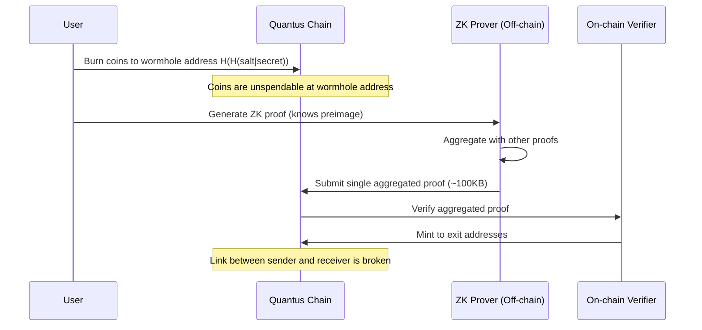
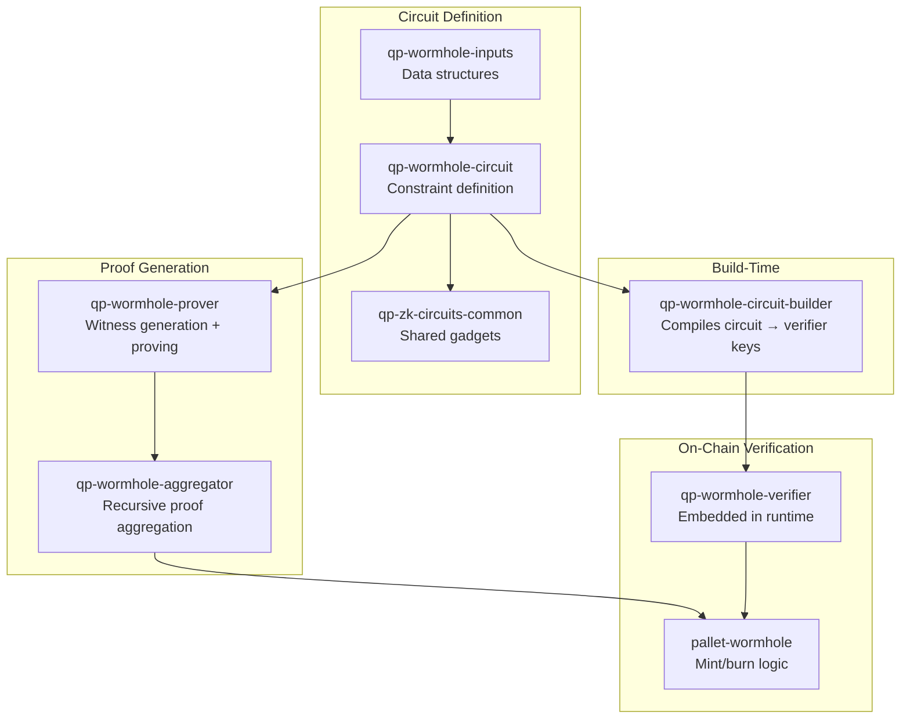
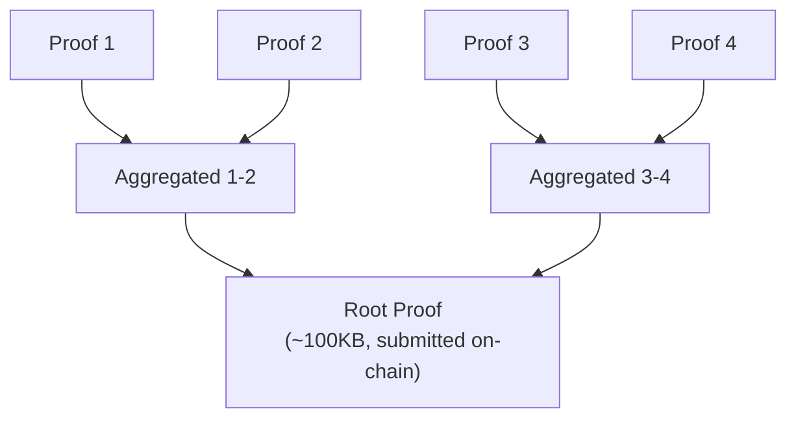

# Wormhole & ZK Scaling

The Wormhole system is Quantus's solution to the post-quantum signature bloat problem. It uses zero-knowledge proofs to aggregate thousands of transactions into a single compact proof, achieving ~153,000 TPS while also providing transaction privacy.

## The Problem

Post-quantum signatures (ML-DSA-87) are ~70x larger than ECDSA. Without mitigation, raw PQC throughput on Quantus would be ~685 TPS -- better than Bitcoin, but a bottleneck for a modern blockchain. Every block would be dominated by signature data.

## The Solution: Burn-and-Remint with ZK Proofs

Wormhole addresses allow users to transfer value without including a full Dilithium signature on-chain for each individual transaction:

### Step by Step

1. **Burn**: User sends coins to an unspendable wormhole address computed as `H(H(salt|secret))` where H is Poseidon2
2. **Prove**: User generates a ZK proof (off-chain) demonstrating they know the preimage that maps to the wormhole address, without revealing it
3. **Aggregate**: Multiple users' proofs are recursively composed into a single aggregated proof using Plonky2
4. **Verify**: The aggregated proof (~100KB regardless of transaction count) is submitted on-chain
5. **Mint**: The on-chain verifier validates the proof and mints coins to the specified exit addresses

## Performance Impact

| Metric | Without Wormhole | With Wormhole |
|--------|-----------------|---------------|
| Per-transaction on-chain data | ~7,219 bytes (sig + pubkey) | Amortized ~few bytes (shared proof) |
| Throughput | ~685 TPS | ~153,000 TPS |
| Improvement | Baseline | **~223x** |

The aggregated proof is approximately 100KB regardless of how many transactions it contains, because Plonky2 supports recursive proof composition.

## ZK Proof System: Plonky2

Quantus uses [Plonky2](https://github.com/0xPolygonZero/plonky2), a STARK-based proof system maintained by Polygon Zero (forked and maintained by Quantus as [qp-plonky2](https://github.com/Quantus-Network/qp-plonky2)).

**Key properties:**
- **No trusted setup** -- Unlike Groth16 or PLONK, STARKs require no ceremony
- **Recursive composition** -- Proofs can verify other proofs, enabling aggregation
- **Field:** Goldilocks (p = 2^64 - 2^32 + 1) -- optimized for 64-bit CPUs
- **Hash function:** Poseidon2 over Goldilocks field (same as used throughout Quantus)

## Circuit Architecture

The ZK circuit system is organized as a pipeline of independent crates:

### Crate Inventory

| Crate | Path | Purpose |
|-------|------|---------|
| `qp-zk-circuits-common` | `common/` | Shared gadgets, utilities, traits |
| `qp-wormhole-inputs` | `wormhole/inputs/` | Input data structures for the circuit |
| `qp-wormhole-circuit` | `wormhole/circuit/` | Circuit constraint definition |
| `qp-wormhole-prover` | `wormhole/prover/` | Proof generation |
| `qp-wormhole-verifier` | `wormhole/verifier/` | On-chain proof verification |
| `qp-wormhole-aggregator` | `wormhole/aggregator/` | Recursive proof aggregation (tree structure) |
| `qp-wormhole-circuit-builder` | `wormhole/circuit-builder/` | Build-time circuit compilation |

**Source:** [qp-zk-circuits](https://github.com/Quantus-Network/qp-zk-circuits)

## Privacy Model

Wormhole addresses provide transaction privacy as a structural feature, not as an add-on:

**What is visible on-chain:**
- The amount burned to a wormhole address
- The wormhole address itself
- The exit address and amount minted
- The aggregated proof

**What is NOT visible on-chain:**
- The link between who burned and who received
- The preimage / secret used to derive the wormhole address

This is architecturally similar to Tornado Cash's privacy model, but integrated at the protocol level rather than as a smart contract overlay.

### Nullifiers

Each wormhole transaction produces a **nullifier** -- a value derived from the secret that is unique per transaction. The chain stores all used nullifiers and rejects any proof that reuses one. This prevents double-spending without revealing the sender's identity.

## Proof Aggregation

The aggregator uses a recursive tree structure:

1. Individual proofs are generated for each wormhole transaction
2. Pairs of proofs are recursively verified and composed into a parent proof
3. The tree continues until a single root proof remains
4. Only the root proof (~100KB) is submitted on-chain

The aggregator handles padding (when the number of proofs isn't a power of two) and ensures that proofs from different blocks, assets, or fee policies are not incorrectly mixed.

## On-Chain Verification

The verifier is compiled at build time and embedded in the node binary. The runtime's `pallet-wormhole` calls into the verifier to validate aggregated proofs:

1. Parse the aggregated proof's public inputs
2. Verify the ZK proof against the embedded verification key
3. Check all nullifiers are unused
4. Mint the specified amounts to the exit addresses
5. Store the nullifiers to prevent replay

### Unsigned Submission

Aggregated proofs are submitted as **unsigned transactions** (no signature required) because the ZK proof itself authenticates the transaction. This avoids adding another Dilithium signature on top of the proof.

## Voting Circuit

The `qp-zk-circuits` repository also contains a **voting circuit** (`voting/`) for on-chain vote eligibility and double-vote prevention. This circuit is not yet published but shares infrastructure with the wormhole circuit.

## Technical Resources

- **Repository:** [qp-zk-circuits](https://github.com/Quantus-Network/qp-zk-circuits) (15-page DeepWiki available)
- **Proof system fork:** [qp-plonky2](https://github.com/Quantus-Network/qp-plonky2)
- **Audit:** Eiger ZK circuit audit (in progress)
