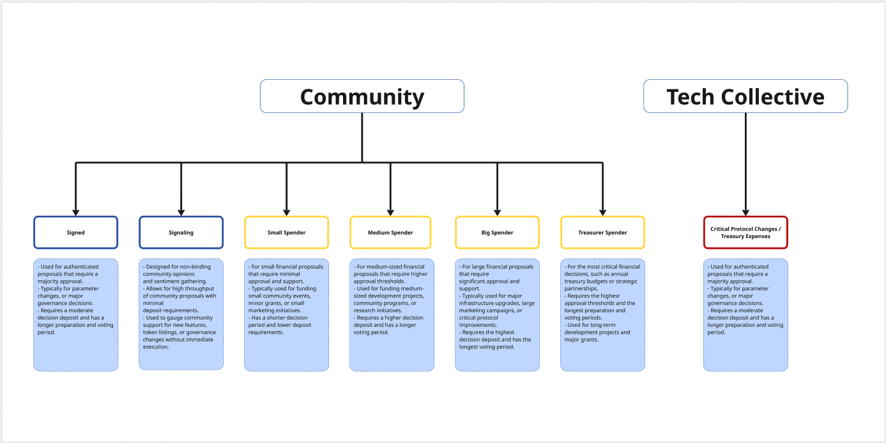

# Governance

## Introduction



Quantus incorporates an on-chain governance system designed to facilitate decentralized decision-making while maintaining technical stability and security. The governance architecture is built on Substrate's pallets, utilizing two separate referendum systems: a Community-driven track system and a specialized Technical Collective.

At its core, Quantus's governance is structured around two distinct mechanisms:

1. **Community Governance**: A five-track referendum system that allows general community participation in decision-making processes with varying levels of required support and approval, utilizing conviction voting.
2. **Technical Collective**: A specialized committee of members who can vote on technical proposals with equal voting weights, focused on managing critical protocol changes through a ranked collective mechanism.

The technical architecture of the Quantus governance system is composed of several integrated components:

1. **Technical Collective**: A flat membership structure where members have equal voting power, with access restricted to root and existing members. This collective uses the ranked collective pallet for simple yes/no voting with equal member weights.
2. **Community Track System**: A two-track approach to proposal categorization, separating authenticated proposals (signed track) from general community signaling, implemented through the conviction voting pallet.
3. **Dual Referendum Systems**: Separate referendum instances for the Technical Collective and Community Governance, each with its own tracks and configuration parameters.
4. **Preimage and Scheduler Integration**: Infrastructure to store, manage, and execute proposals once approved through either governance mechanism.

This dual governance system enables Quantus to implement changes with appropriate levels of security and community involvement based on the significance of each change. The Technical Collective provides specialized oversight for critical protocol functions through a simplified equal-weight voting system, while the Community tracks allow broader participation with conviction-weighted voting in the network's evolution.

The following documentation details the technical implementation of this governance system, exploring its components, security controls, and interaction patterns to provide a comprehensive understanding of how decentralized decision-making operates within the Quantus ecosystem.

# Quantus DAO Governance Decision Paths

### **Technical Collective Paths:**

**Critical Protocol Changes** 

- Reserved for fundamental system modifications
- Highest security thresholds
- Controlled by Technical Collective members

### **Community Governance:**

1. **Path 0: Protocol Improvements**
    - For authenticated proposals requiring elevated privileges
    - Moderate security thresholds
    - Open to all token holders

    [Detailed configuration](governance/path_0.md)
    
2. **Path 1: Community Signaling**
    - For non-binding community sentiment gathering
    - Minimal security thresholds
    - Designed for maximum participation

    [Detailed configuration](governance/path_1.md)

3. **Path 2: Treasury Small Spender**
    - For small treasury disbursements
    - Lower approval and support thresholds
    - Ideal for community grants and small project funding

    [Detailed configuration](governance/path_2.md)

4. **Path 3: Treasury Medium Spender**
    - For medium-sized treasury disbursements
    - Moderate approval and support thresholds
    - Suitable for larger community projects and initiatives

    [Detailed configuration](governance/path_3.md)

5. **Path 4: Treasury Big Spender**
    - For large treasury disbursements
    - Higher approval and support thresholds
    - Reserved for significant community initiatives and partnerships

    [Detailed configuration](governance/path_4.md)

6. **Path 5: Treasury Treasurer**
    - For significant treasury operations
    - Highest security thresholds
    - Restricted to designated treasury treasurer accounts

    [Detailed configuration](governance/path_5.md)

### Referendum Parameters

Each referendum type defines a decision path along with its parameters:

- **name**: Name of the track (e.g., "root", "signed", "signaling")
- **max_deciding**: Maximum number of concurrent referenda in deciding phase. Additionally, we have a global parameter (100) that defines the maximum number of proposals that can be waiting in the queue.
- **decision_deposit**: Deposit required to move to the deciding phase
- **prepare_period**: Preparation period before voting begins
- **decision_period**: Voting/deciding period duration
- **confirm_period**: The duration during which an approved referendum must continuously maintain the required approval and support thresholds before being finalized. This acts as a security mechanism against last-minute voting manipulations by requiring sustained consensus over time. During this period, voters can still change their votes, and if support drops below the required thresholds, the referendum returns to the deciding phase. Only after successfully passing through the entire confirmation period can a referendum be considered fully approved and scheduled for execution.
- **min_enactment_period**: The mandatory waiting period between a referendum's final approval and its actual execution on-chain. This delay serves multiple critical purposes: it provides time for the community to prepare for upcoming changes, allows developers to verify their implementations, allows stakeholders to adjust their positions if necessary, and provides a safety buffer against any unforeseen issues. During this period, the approved code or change cannot be altered, but the community gains valuable time to ready itself for the impending protocol modification before it takes effect.
- **min_approval**: A dynamic threshold system that defines the required percentage of "aye" votes relative to total votes (ayes + nays) for a referendum to pass. Rather than using a fixed percentage, it employs a sophisticated curve mechanism that typically starts high and gradually decreases over time. This approach prevents hasty approvals of controversial proposals while allowing well-supported ones to pass quickly. The curve can be configured with different starting points (ceiling) and ending points (floor), and the rate of decline can be adjusted per governance track based on the sensitivity of decisions in that track. For critical protocol changes, the curve might range from 100% to 75%, while less critical decisions might use more lenient ranges like 60% to 50%.
- **min_support**: A sophisticated metric that measures overall participation in a referendum relative to the total possible voting power in the system. Unlike approval (which measures the ratio of "aye" to total votes cast), support evaluates the absolute level of engagement from all possible voters. This parameter also employs a curve mechanism that typically begins with a higher threshold and gradually decreases over time, encouraging broader participation for important decisions. The support requirement helps prevent situations where proposals could pass with high approval percentages but very low voter turnout. For example, a referendum track might require 25% of all possible votes at the start of voting, declining to 5% by the end of the period. This ensures that major changes cannot be enacted with minimal participation while still allowing decisions to proceed even if perfect turnout is not achieved.

# Technical Collective Management in Quantus Governance

The Quantus governance system provides comprehensive mechanisms for Technical Collective management through its dedicated governance framework. The Technical Collective starts empty and must be initialized by the root account, with all subsequent membership changes occurring through on-chain governance processes.

### Membership Management Operations

The system supports several key operations for Technical Collective management:

1. **Adding Members**: New technical experts can be added through two methods:
    - By the root account directly using `TechCollective::add_member`
    - By existing members proposing `TechCollective::add_member` through the `RootOrMemberForCollectiveOrigin` origin
2. **Removing Members**: Members can be removed via:
    - Root account using `TechCollective::remove_member`
    - Existing members proposing `TechCollective::remove_member`
3. **Referendum-Based Changes**: Technical changes, including membership modifications, can be proposed through the dedicated `TechReferenda` system, which is separate from the community referendum system.

### Governance Security

Operations are protected by robust security controls:

1. **Single Track Design**: The Technical Collective's referendum system uses a single track (Track 0) with strict parameters:
    - 75% minimum approval threshold
    - 5-day decision period
    - 2-day confirmation period
2. **Access Control**: Only root or existing Technical Collective members can:
    - Submit referenda through the `RootOrMemberForTechReferendaOrigin` check
    - Vote on technical proposals
    - Add or remove members
3. **Flat Structure**: Unlike hierarchical systems, the Technical Collective uses a flat structure where all members have equal voting weight, as implemented through the `pallet_ranked_collective` with `Linear` vote weighting.
4. **Membership Limit**: The Technical Collective has a maximum membership limit of 13 members, as defined by the `MaxMemberCount` parameter.
5. **Concurrent Referendum Control**: Only one technical referendum can be in the deciding phase at a time, ensuring focused deliberation on critical changes.

This governance model ensures that the Technical Collective can evolve over time while maintaining the necessary security and access controls appropriate for managing critical protocol components.

# Treasury and Origins in Quantus Governance

The Treasury system in Quantus is designed with multiple layers of control and oversight, integrating both community governance and technical expertise. This multi-layered approach ensures that treasury operations are secure, transparent, and aligned with the network's long-term interests.

## Treasury Origins and Access Control

The Treasury system operates through a sophisticated origin system that determines who can propose and approve spending. There are two main paths for treasury operations:

### 1. Community Treasury Tracks

The community treasury tracks provide a graduated system for treasury spending, with different tracks requiring varying levels of community approval and support. These tracks are accessible to the general community through the referendum system, allowing for broad participation in treasury decisions.

### 2. Technical Collective Oversight

The Technical Collective has a unique role in treasury operations through its ability to act as the Root origin. This is implemented through the `RootOrMemberForCollectiveOriginImpl` and `RootOrMemberForTechReferendaOriginImpl` structures, which allow Technical Collective members to participate in treasury decisions with equal voting weights.

The Technical Collective's involvement in treasury operations provides several key benefits:
- Technical expertise in evaluating complex treasury proposals
- Additional security layer for significant treasury operations
- Ability to act as a check and balance on community treasury decisions
- Equal voting power among members, ensuring fair representation of technical interests

## Implementation Details

The treasury origin system is implemented through several key components:

### 1. Origin Implementation
```rust
pub struct RootOrMemberForCollectiveOriginImpl<Runtime, I>(PhantomData<(Runtime, I)>);
```
This structure allows both Root and Technical Collective members to participate in treasury operations. When a member of the Technical Collective acts, they are treated as having Root-level privileges for treasury operations.

### 2. Origin Verification
The system verifies origins through a combination of:
- Direct Root access
- Technical Collective membership verification
- Community track verification

### 3. Treasury Operations
Treasury operations can be initiated through:
- Community referendum tracks
- Technical Collective proposals
- Direct Root operations

This dual-path system ensures that treasury operations can be executed either through community consensus or through the technical expertise of the Technical Collective, providing flexibility while maintaining security.

## Security Considerations

The Treasury system's security is enhanced by:
- Multiple approval layers
- Technical Collective oversight
- Community participation requirements
- Graduated spending thresholds
- Origin verification at multiple levels

This multi-layered approach ensures that treasury operations are secure and aligned with the network's interests, while still maintaining the flexibility needed for efficient operation.

The integration of Technical Collective oversight through Root origins provides an additional layer of security and expertise to treasury operations, while the community tracks ensure that the broader network can participate in treasury decisions. This balanced approach helps maintain both security and decentralization in treasury management.

## Treasury Revenue Sources

The Quantus Treasury is funded through two primary revenue streams:

1. **Transaction Fees**
   - 10% of all transaction fees are automatically allocated to the Treasury
   - This provides a steady stream of income proportional to network usage
   - Fees are collected automatically during transaction processing

2. **Mining Rewards**
   - Miners can choose to allocate a portion of their mining rewards to the Treasury
   - This is implemented through the `mining-rewards` pallet
   - Miners can configure their reward distribution through the mining configuration
   - Provides an additional voluntary funding mechanism for the Treasury

The detailed implementation and configuration of mining rewards allocation to the Treasury can be found in the `mining-rewards` pallet documentation.

For detailed information about how the Treasury manages fund distribution through vesting schedules and milestone-based grants, please refer to the [Vesting Scenarios in Governance](governance/vesting_scenarios.md) documentation.

## Technical Collective Voting Mechanism

The Technical Collective in Quantus employs the `pallet_ranked_collective` with a `Linear` vote weighting algorithm, though with a significant customization that results in a flat organizational structure.

### Linear Vote Weighting Algorithm

The `Linear` vote weighting algorithm in a standard ranked collective would typically assign voting power based on a member's rank or level within the organization. Higher-ranked members would receive proportionally greater voting weight, creating a hierarchical voting structure.

### Flat Structure Implementation

In Quantus's Technical Collective implementation:

- **No Rank Differentiation**: Although the underlying pallet supports hierarchical ranks, Quantus configures the collective with `MinRankOfClassDelta` set to 0, effectively flattening the structure.
- **Equal Voting Power**: All members possess identical voting power regardless of when they joined or who added them. Each vote counts exactly the same, whether cast by founding members or more recently added experts.
- **One-Member-One-Vote**: The system functions purely as a one-member-one-vote democracy within the collective, eliminating potential power imbalances from a traditional ranked structure.
- **Promotion/Demotion Disabled**: The configuration deliberately disables the promotion and demotion functions by setting `PromoteOrigin` and `DemoteOrigin` to `NeverEnsureOrigin`, ensuring the collective remains flat.

This flat structure was deliberately chosen for the Technical Collective to:

1. Ensure equal representation among technical experts
2. Prevent power concentration in a subset of members
3. Foster collaborative decision-making based on expertise rather than seniority
4. Simplify the governance process for technical matters

When Technical Collective members vote on referenda, each member's vote carries exactly the same weight, creating a pure democratic process within this specialized group while still maintaining the exclusive membership required for protocol-critical decisions.

## Conviction Voting in Quantus Community Governance

For community governance, conviction voting functions as a vote-weighting mechanism that operates alongside approval and support threshold configurations. When casting a vote, token holders can choose a conviction level that multiplies their voting power (from 1x to 6x) in exchange for locking their tokens for a proportionally longer period.

- **Path 0 (Signed Track)**: For authenticated proposals that require privileges, conviction voting helps measure both approval (55-70% approval curve) and support (5-25% support curve) with weighted voting power.
- **Path 1 (Signaling Track)**: For non-binding community opinions, conviction voting influences both approval (50-60% approval curve) and support (1-10% support curve) thresholds.